# **Takım İsmi**

Takım Flutter 65

# Ürün İle İlgili Bilgiler

## Takım Elemanları
- Sümeyye Armutcu - Scrum Master
- Mert Göker - Product Owner/Developer
- Talha Demirbaş - Developer
- Nurefşan Ergören - Developer
- Beyza Demir - Aktif Değil

## Ürün İsmi

--CineShuffle--
## Product Backlog URL
[Flutter Team 65 Miro Backlog Board](https://miro.com/app/board/uXjVM-aBW5Q=/)
## Ürün Açıklaması
- CineShuffle kullanıcıların izlemek istedikleri filmlere daha hızlı bir şekilde karar vermelerine yardımcı olan bir mobil uygulamadır. Binlerce film içeriği sunan uygulamamız, geniş bir seçenek yelpazesi ile kullanıcılara film önerileri sunar ve aynı zamanda filmlerin IMDB puanlarını gösterir. Kullanıcılar, CineShuffle sayesinde zaman kaybetmeden sevdikleri filmleri bulabilir ve yeni filmler keşfedebilirler.

- **Uygulama birincil fonksiyonu**: 
 CineShuffle, kullanıcılara film önerileri sunarak izlemek istedikleri filmlere karar vermelerini kolaylaştırır. Kullanıcılar, uygulamada filmler hakkında ayrıntılı bilgilere erişebilir ve IMDB puanlarını görebilir.

- **Uygulama ikincil fonksiyonu**:
 CineShuffle, rastgele film seçme özelliği ile kullanıcılara sürpriz bir film deneyimi yaşatır. Kullanıcılar, uygulama üzerinden rastgele film seçeneğini kullanarak izlemek için yeni ve farklı bir film keşfedebilirler. Bu özellik, kullanıcıların rutinlerinden çıkıp keşif yapmalarını sağlayarak sinema deneyimlerini zenginleştirir.

## Ürün Özellikleri
- Binlerce film içeriği: Kullanıcılara geniş bir film arşivi sunulur, farklı kategorilerde binlerce film bulunur.
- IMDB puanları: Her film için IMDB puanı görüntülenir.
- Rastgele film seçme özelliği: Kullanıcılar, uygulama üzerinden rastgele film seçeneğini kullanarak izlemek için yeni ve farklı bir film keşfedebilirler.

## Hedef Kitle
- Film tutkunları: Sinema ve film dünyasına ilgi duyan ve yeni filmler keşfetmek isteyen bireyler.
- Kararsız izleyiciler: Filmler arasında kararsız kalan ve ne izleyeceğine karar veremeyen kullanıcılar.
- IMDB puanına önem verenler: Filmlerin IMDB puanlarına göre seçim yapmak isteyen ve yüksek puanlı filmleri tercih eden kullanıcılar.
- Keşifçi izleyiciler: Rutinlerinden çıkıp yeni ve farklı filmler keşfetmek isteyen kullanıcılar.

# Sprint 1
 **Sprint Notları**: User Story'ler product backlog'ların içine yazılmıştır. Product backlog item'lara tıklandığında hikayelerin detayları okunabilir.

- **Sprint içinde tamamlanması tahmin edilen puan**: 100 Puan

- **Puan tamamlama mantığı**: Toplamda proje boyunca tamamlanması gereken 300 puanlık backlog bulunmaktadır. 3 sprint'e bölündüğünde ilk sprint'in en azından 100 ile başlaması gerektiğine karar verildi.

- **Backlog düzeni ve Story seçimleri**: Backlog'umuz ilk yapılacak story'lere göre düzenlenmiştir. Sprint başına tahmin edilen puan sayısını geçmeyecek şekilde sıradan seçimler yapılmaktadır. Story başına çıkan tahmin puanı, toplam puanın yarısından az tutulmuştur. 

- Story'ler yapılacak işlere (task'lere) bölünmüştür. Miro Board'da gözüken kırmızı item'lar yapılacak işleri (task) gösterirken, mavi item'lar story'leri temsil etmektedir.

- **Daily Scrum**: Daily Scrum toplantılarının zamansal sebeplerden ötürü WhatsApp ve Discord üzerinden yapılmasına karar verilmiştir. Daily Scrum toplantısı örneği jpeg veya word olarak Readme'de tarafımızdan paylaşılmaktadır: [Sprint 1 Daily Scrum Chats](Project-Management/DailyScrumMeetingNotesSprint1.docx)

- **Sprint board update**: Sprint board screenshotları: 
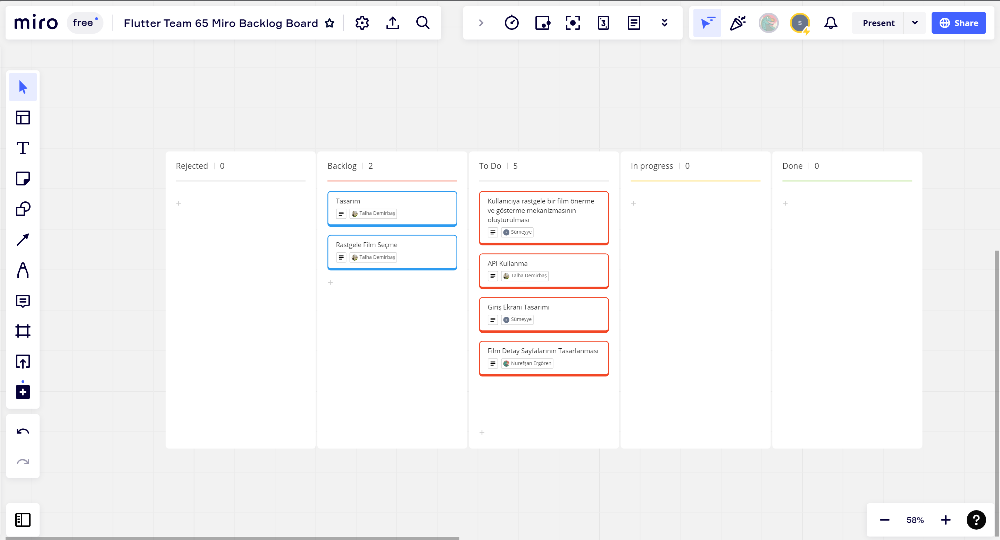
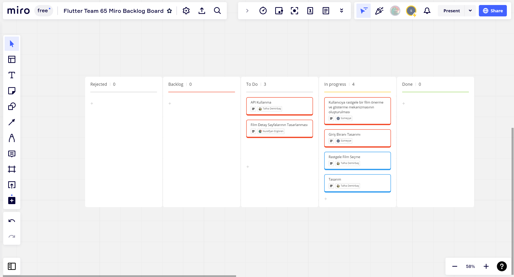
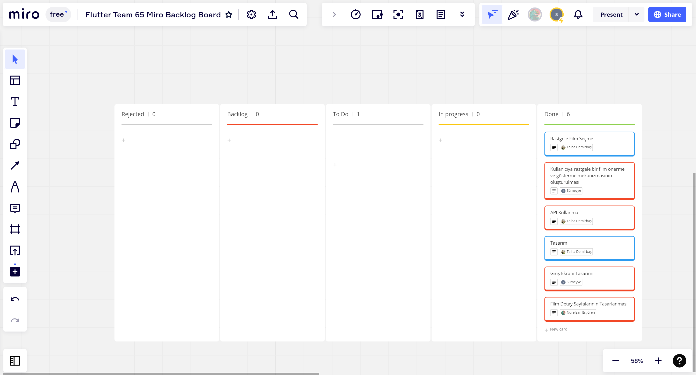

- **Ürün Durumu**: Ekran görüntüleri:
  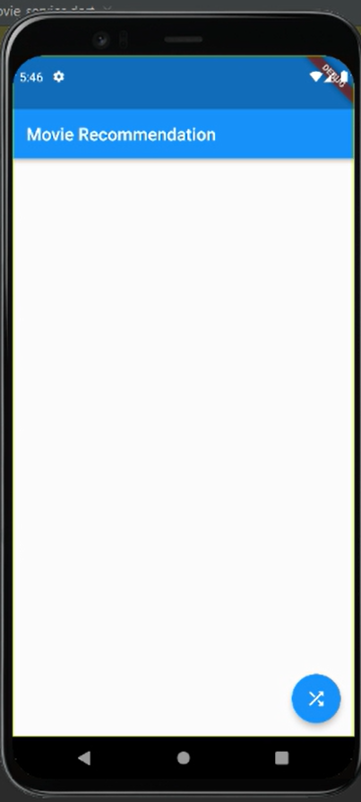
  
  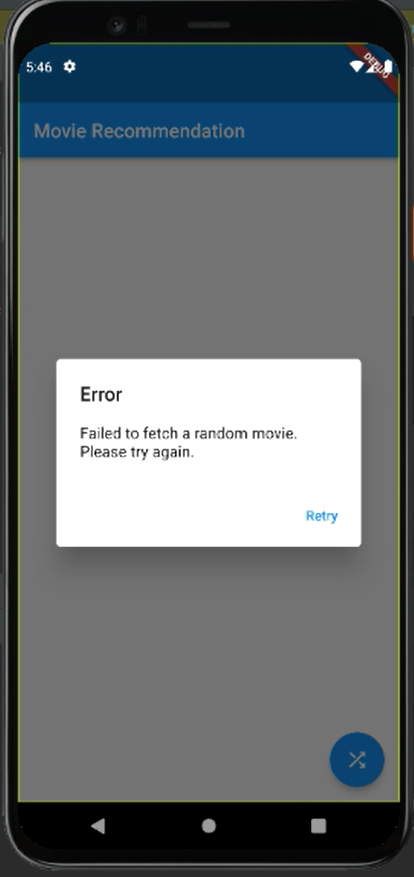
- **Sprint Review**: 
Alınan kararlar: Giriş ve film için temel sayfalar oluşturulmuştur, hatayla karşılaşıldığında uyarı mesajı ekrana verilmiştir.
Sprint Review katılımcıları:Talha Demirbaş, Sümeyye Armutcu, Nurefşan Ergören 

- **Sprint Retrospective:**
  - Takım içindeki görev dağılımıyla ilgili düzenleme yapılması kararı alınmıştır.
  - Takım üyelerinin gelecek sprintlerde aktif olması gerektiğine vurgu yapılmıştır.
  
 ## Product Backlog URL
[Flutter Team 65 Miro Backlog Board](https://miro.com/app/board/uXjVM-aBW5Q=/)

# Sprint 2
 **Sprint Notları**: User Story'ler product backlog'ların içine yazılmıştır. Product backlog item'lara tıklandığında hikayelerin detayları okunabilir.

- **Sprint içinde tamamlanması tahmin edilen puan**: 100 Puan

- **Puan tamamlama mantığı**: Toplamda proje boyunca tamamlanması gereken 300 puanlık backlog bulunmaktadır.İlk sprintten hedeflenen 100 puan alınmıştır. İkinci sprint için de aynı şekilde 100 puan hedef konulmuştur.
  
- **Backlog düzeni ve Story seçimleri**: Backlog'umuz ilk yapılacak story'lere göre düzenlenmiştir. Sprint başına tahmin edilen puan sayısını geçmeyecek şekilde sıradan seçimler yapılmaktadır. Story başına çıkan tahmin puanı, toplam puanın yarısından az tutulmuştur. 

- Story'ler yapılacak işlere (task'lere) bölünmüştür. Miro Board'da gözüken kırmızı item'lar yapılacak işleri (task) gösterirken, mavi item'lar story'leri temsil etmektedir.

- **Daily Scrum**: Daily Scrum toplantılarının zamansal sebeplerden ötürü WhatsApp ve Discord üzerinden yapılmasına karar verilmiştir. Daily Scrum toplantısı örneği jpeg veya word olarak Readme'de tarafımızdan paylaşılmaktadır: [Sprint 2 Daily Scrum Chats](Project-Management/DailyScrumMeetingNotesSprint_2.docx)

- **Sprint board update**: Sprint board screenshotları: 
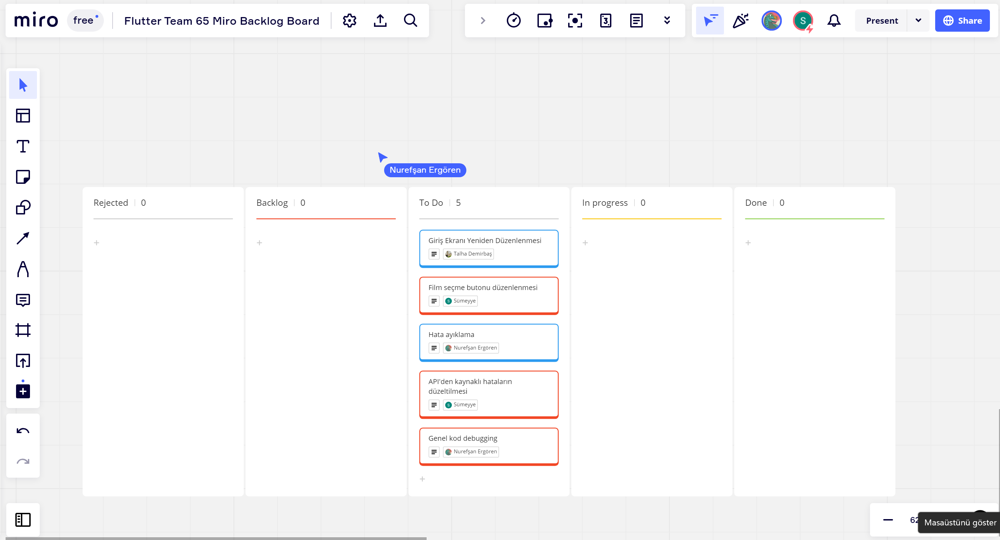
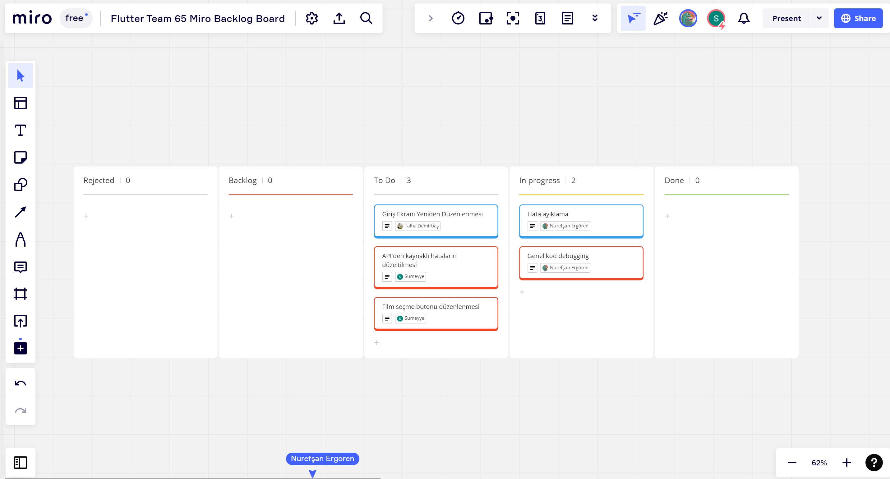
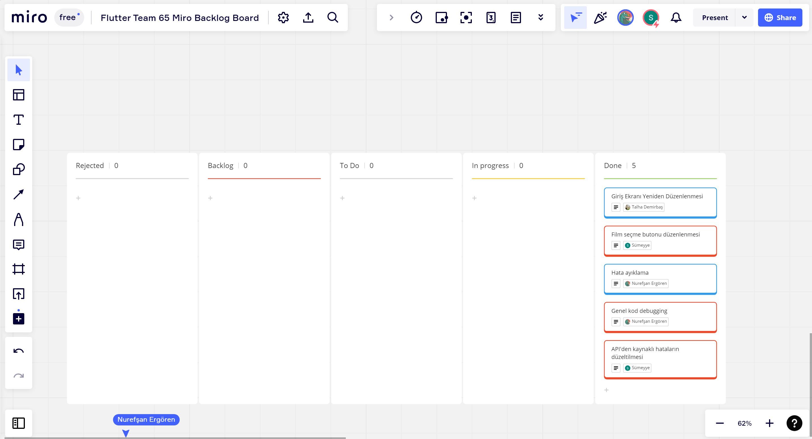

- **Ürün Durumu**: Ekran görüntüleri:
  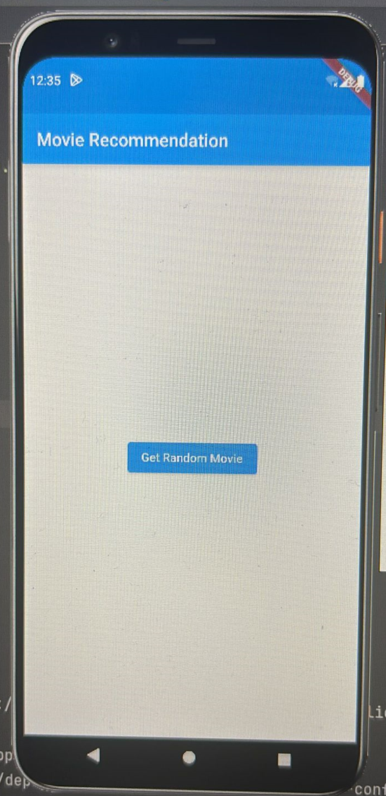
  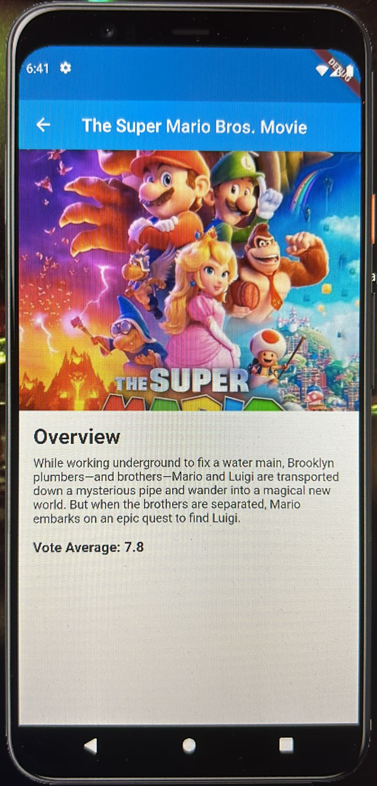
  
- **Sprint Review**: 
Alınan kararlar: Giriş ve film için temel sayfalar yeniden oluşturulmuştur, hatalar azaltılmış, hatayla karşılaşıldığında uyarı mesajı ekrana verilmiştir.
Sprint Review katılımcıları: Sümeyye Armutcu, Nurefşan Ergören

- **Sprint Retrospective:**
  - Takım üyelerinin gelecek sprintlerde aktif olması gerektiğine vurgu yapılmıştır.

 ## Product Backlog URL
[Flutter Team 65 Miro Backlog Board](https://miro.com/app/board/uXjVM-aBW5Q=/)

# Sprint 3
 **Sprint Notları**: User Story'ler product backlog'ların içine yazılmıştır. Product backlog item'lara tıklandığında hikayelerin detayları okunabilir.

- **Sprint içinde tamamlanması tahmin edilen puan**: 100 Puan

- **Puan tamamlama mantığı**: Toplamda proje boyunca tamamlanması gereken 350 puanlık backlog bulunmaktadır.İlk 2 sprintten hedeflenen 200 puan alınmıştır. Üçüncü sprint için de aynı şekilde 100 puan hedef konulmuştur.
  
- **Backlog düzeni ve Story seçimleri**: Backlog'umuz ilk yapılacak story'lere göre düzenlenmiştir. Sprint başına tahmin edilen puan sayısını geçmeyecek şekilde sıradan seçimler yapılmaktadır. Story başına çıkan tahmin puanı, toplam puanın yarısından az tutulmuştur. 

- Story'ler yapılacak işlere (task'lere) bölünmüştür. Miro Board'da gözüken kırmızı item'lar yapılacak işleri (task) gösterirken, mavi item'lar story'leri temsil etmektedir.

- **Daily Scrum**: Daily Scrum toplantılarının zamansal sebeplerden ötürü WhatsApp üzerinden yapılmasına karar verilmiştir. Daily Scrum toplantısı örneği jpeg veya word olarak Readme'de tarafımızdan paylaşılmaktadır: [Sprint 3 Daily Scrum Chats](Project-Management/DailyScrumMeetingNotesSprint_3.docx)

- **Sprint board update**: Sprint board screenshotları: 
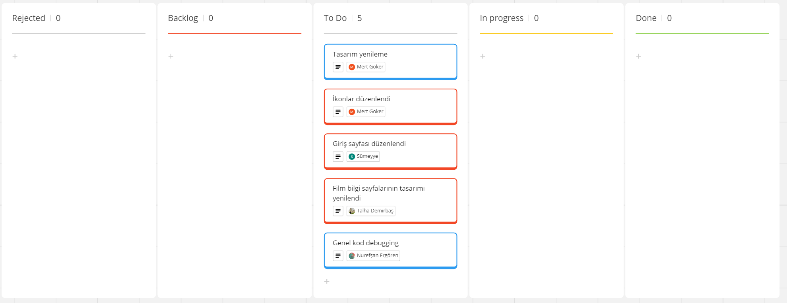
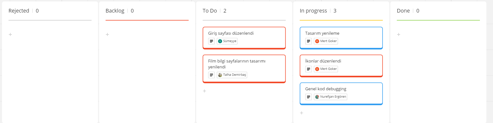
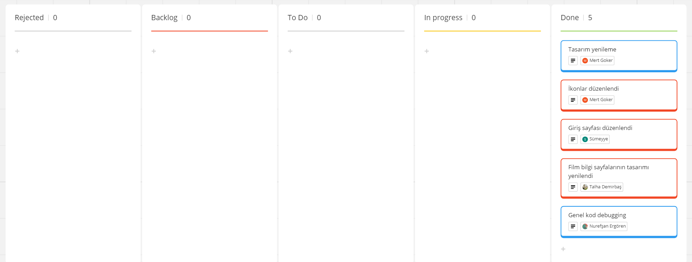

- **Ürün Durumu**: Ekran görüntüleri:
  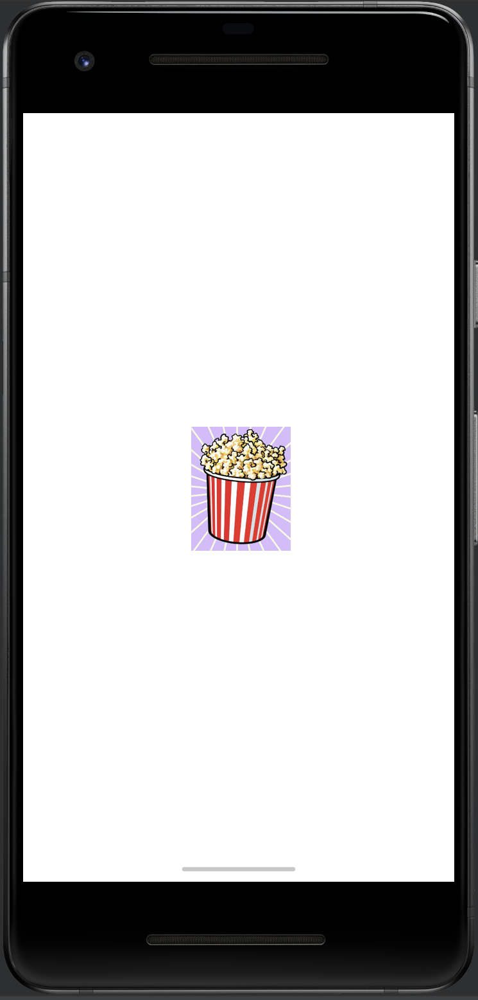
  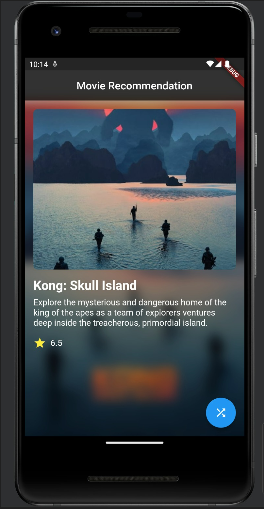
  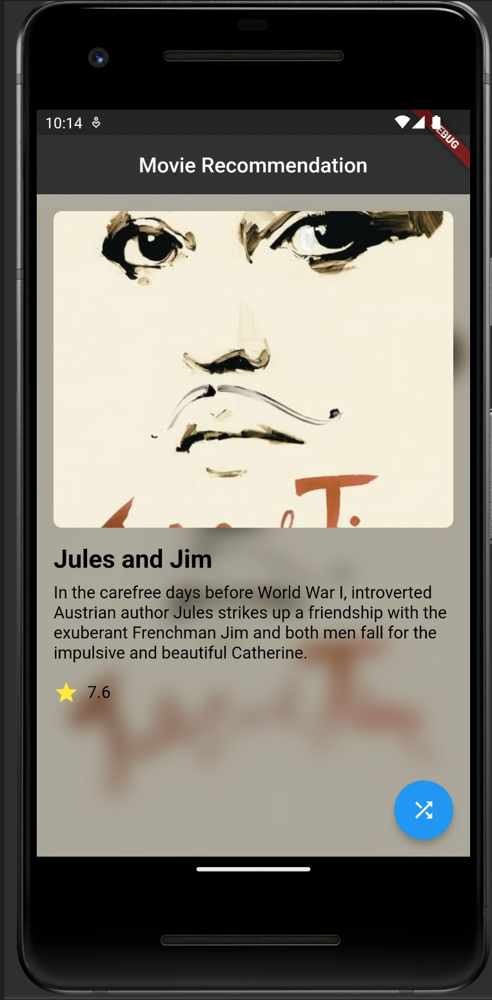
- **Sprint Review**: 
Alınan kararlar: Giriş ve film için temel sayfaların tasarımı geliştirilmiş, ikonlar yenilenmiş, hatalar azaltılmıştır.
Sprint Review katılımcıları: Talha Demirbaş, Sümeyye Armutcu, Nurefşan Ergören, Mert Göker.

- **Sprint Retrospective:**
  - Ürün başarıyla bitirilmiştir. Takım arkadaşlarına emekleri için teşekkür edilmiştir.
 

---

